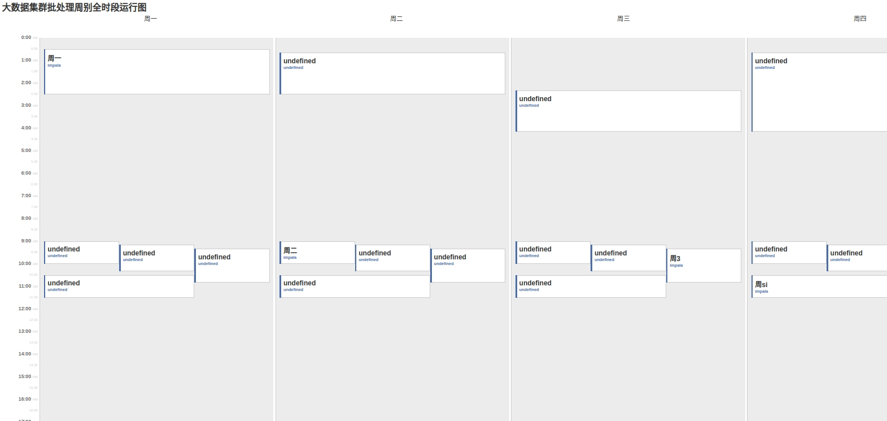

# Job Calendar

## 简介
基于原作者的项目（bunnyc1986/js-calendar），我对这个js插件进行了改造，把他变成了一个可以显示一周七天小时粒度的日程表。
我个人把它用来当作数仓和大数据平台批处理任务的任务一览表。

在原作者的基础上追加了如下功能：
* 扩展了时间范围，现实24小时，一周7天的日历。
* 扩展了任务标题和任务描述字段，可以在任务项上显示标题和描述。
* UI优化

## 使用
在index中，编辑event1、event2、event3...event7等变量。
event1对应周一的日程表，event2对应周二的日程表，以此类推。

## 预览图

